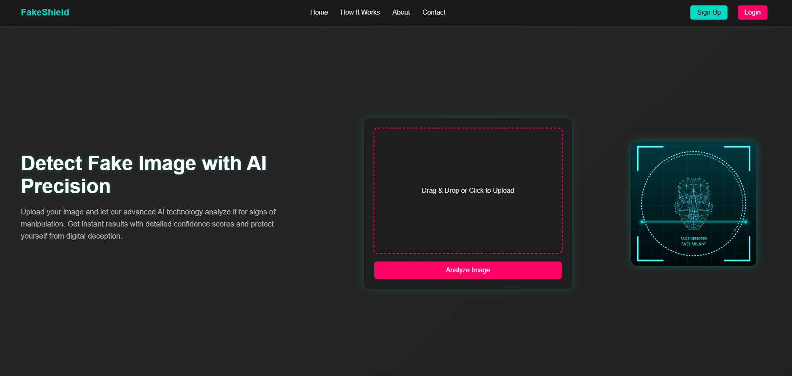
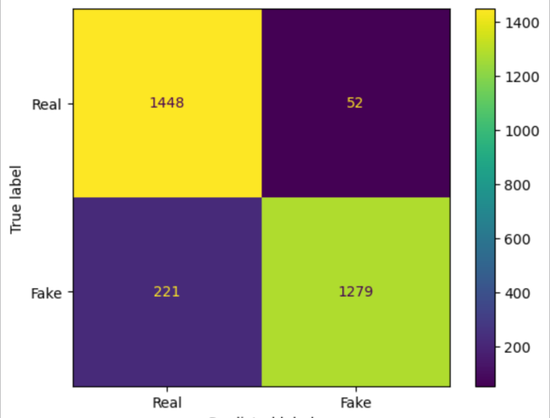
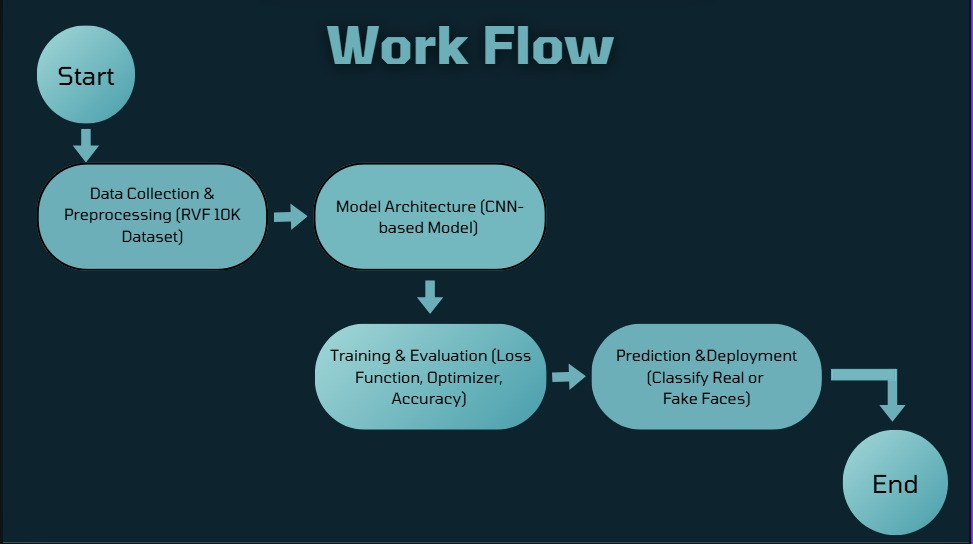

# FakeShield - AI-Powered Fake Image Detection



## 🚀 About the Project
FakeShield is an AI-powered image verification platform that detects manipulated or deepfake images in real-time. It helps combat misinformation, fraud, and digital deception in various industries like social media, journalism, law enforcement, and finance.

## 📌 Features
- 🖼️ **Image Upload & Analysis** - Users can upload images to check authenticity.
- 🧠 **Deep Learning-Based Detection** - Uses CNN models to differentiate real vs. fake images.
- 📊 **Performance Metrics** - Accuracy, Loss, Precision, Recall, and F1-score analysis.
- 📉 **Confusion Matrix Visualization** - Detailed insights into model predictions.
- 🌍 **Scalable & User-Friendly** - Can be integrated into various industries.

---
## 🏗️ Tech Stack
- **Backend:** Flask, PyTorch
- **Frontend:** HTML, CSS, JavaScript
- **Database:** SQL

---
## 🎯 Model Performance

| Metric        | Value  |
|--------------|--------|
| **Accuracy**  | 91% |
| **Loss**      | 3% |
| **Precision** | 96% (for fake image)|
| **Recall**    | 85% |
| **F1 Score**  | 91% |

📌 **Confusion Matrix:**


📌 **Workflow:**


---
## 🏆 Mission & Vision
**Mission:** To create a reliable and scalable AI-powered fake image detection platform that enhances digital trust and combats misinformation across industries.

**Vision:** To be the global leader in AI-driven authenticity verification, ensuring transparency and security in digital media.

---
## 🔍 SWOT Analysis
### **Strengths:**
- High accuracy in fake image detection.
- Scalable and adaptable technology.
- Can be integrated into multiple industries.

### **Weaknesses:**
- Dependency on AI model improvements.
- Potential false positives/negatives.

### **Opportunities:**
- Growing demand for misinformation detection.
- Potential for expansion into video deepfake detection.

### **Threats:**
- Advancements in deepfake technology making detection harder.
- Privacy concerns related to AI-based verification.

---
## ⚡ Installation & Usage
1. Clone the repository:
   ```sh
   git clone https://github.com/yourusername/FakeShield.git
   cd FakeShield
   ```
2. Install dependencies:
   ```sh
   pip install -r requirements.txt
   ```
3. Run the application:
   ```sh
   python app.py
   ```
4. Access at: `http://localhost:5000`

---
## 📌 Future Scope
- ✅ Enhancing deep learning model accuracy
- ✅ Deploying as a browser extension & API
- ✅ Expanding support for video deepfake detection

---
## 👨‍💻 Contributors
- **Srinjoy Pramanik** - Backend & AI Model Integration
- **Soumyajit Datta** - Backend & PPT
- **Rudrasish Dutta** - Model Training & Data Collection

---
## 📜 License
This project is licensed under the MIT License - see the [LICENSE](LICENSE) file for details.

---
## ⭐ Support & Feedback
If you like this project, don't forget to ⭐ star the repository! Feel free to contribute or raise an issue for improvements. 🚀
